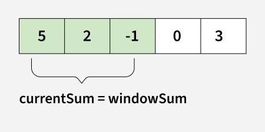
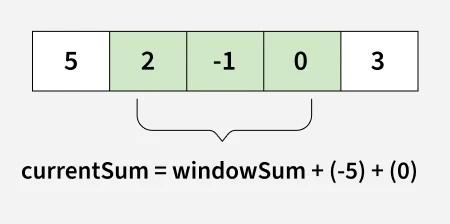
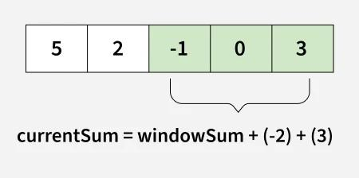

# Sliding window
is a method used to solve problems that involve subarrays or substring or window.
    - Instead of repeatedly iterating over the same elements, the sliding window maintains a range (or "window") that moves step-by-step through the data,    updating results incrementally.
    - The main idea is to use the results of previous window to do computations for the next window.
    - Commonly used for problems like finding subarrays with a specific sum, finding the longest substring with unique characters, or solving problems that require a fixed-size window to proccess elements efficiently.
# Example Problem - Maximum Sum of a Subarray with K Elements
Given an array arr[] and an integer k, we need to calculate the maximum sum of a subarray having size exactly k.

Input  : arr[] = [5, 2, -1, 0, 3], k = 3
Output : 6
Explanation : We get maximum sum by considering the subarray [5, 2 , -1]

Input  : arr[] = [1, 4, 2, 10, 23, 3, 1, 0, 20], k = 4 
Output : 39
Explanation : We get maximum sum by adding subarray [4, 2, 10, 23] of size 4.

Consider an array arr[] = {5, 2, -1, 0, 3} and value of k = 3 and n = 5

# Using the Sliding Window Technique - O(n) Time and O(1) Space

    -We compute the sum of the first k elements out of n terms using a linear loop and store the sum in variable window_sum.
    -Then we will traverse linearly over the array till it reaches the end and simultaneously keep track of the maximum sum.
    -To get the current sum of a block of k elements just subtract the first element from the previous block and add the last element of the current block.

Consider an array arr[] = {5, 2, -1, 0, 3} and value of k = 3 and n = 5
this is a initial phase where we have calculated the initial window sum starting from index 0. At this stage the window sum is 6. Now, we set the maximum_sum as current_window:



Now, we slide our window by a unit index. Therefore, now it discards 5 from the window and adds 0 to the window.
Hence, we will get our new window sum by substracting 5 and then adding 0 to i. So, our window sum now becomes 1. Now, we will compare this window summ with the maximum_sum. As it is smaller, we wont change the maximum_sum



Similarly, now once again we slide our window by a unit index and obtain the new window sum to be 2. Again we check if this current window sum is greater than the maximum_sum till now. Onde again it is smaller so we dont change the maximum_sum.
Therefore, for the above array our maximum_sum is 6.



```cpp
#include <iostream>
#include <vector>
using namespace std;

int maxSum(vector<int>& arr, int k){
    int n = arr.size();

    // n must be greater
    if (n <= k) {
        cout << "Invalid";
        return -1;
    }

    // Compute sum of first window of size k
    int max_sum = 0;
    for (int i = 0; i < k; i++)
        max_sum += arr[i];

    // Compute sums of remaining windows by
    // removing first element of previous
    // window and adding last element of
    // current window.
    int window_sum = max_sum;
    for (int i = k; i < n; i++) {
        window_sum += arr[i] - arr[i - k];
        max_sum = max(max_sum, window_sum);
    }

    return max_sum;
}

int main(){
    vector<int> arr = {5, 2, -1, 0, 3};
    int k = 3;
    cout << maxSum(arr, k);
    return 0;
}
```