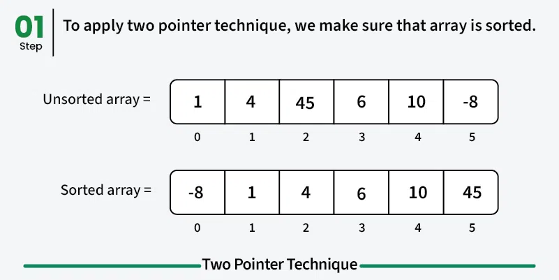
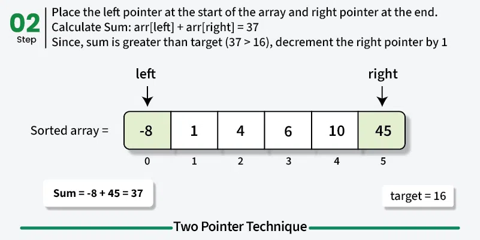
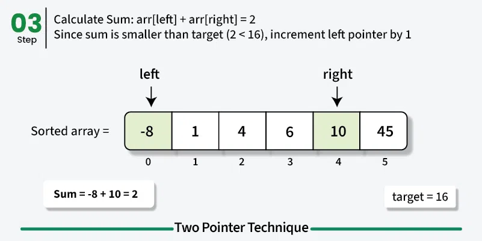
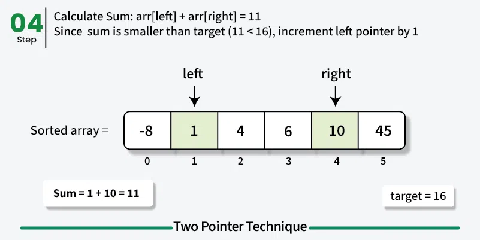
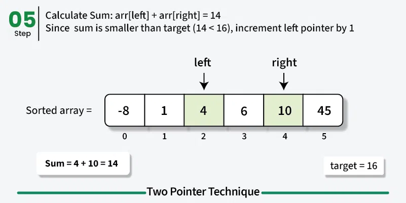
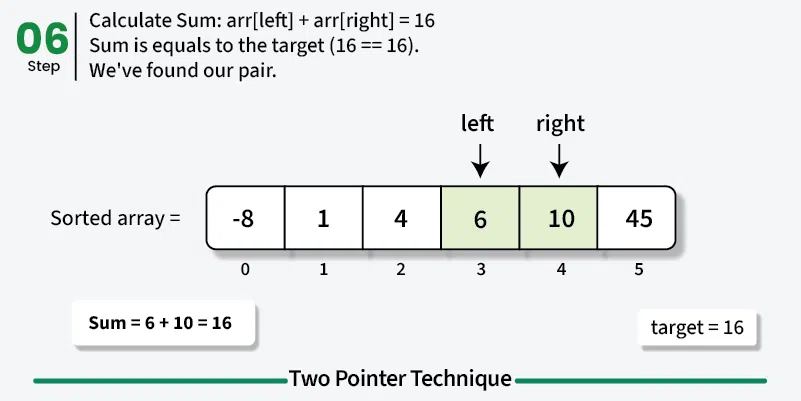

# Two Pointers technique
The two pointers technique is a simple yet powerful strategy where you use ywo indices (pointer) that traverse a data structure - such as an array, list or string - either toward each other or in the same direction to solve problems more efficiently. 
Two pointers is really an easy and efective technique that is tipically used for "Two Sum in Sorted Arrays, Closest Two Sum, Three Sum, Four Sum, Trapping Rain Water" and many other popular interview questions.

# When to use Two pointers 
- Sorted input: if the array or list is already sorted (or can be sorted), two pointers can efficiently find pairs or ranges example: Find Two numbers in a sorted array that add up to a target.
- Pairs o subarrays: When the problem asks about two elements, subarrays, or ranges instead of working with single elements, example: Longest substring without repeating characters, maximum consecutive ones, checking if a string is palindrome.
- Sliding window problems: When you need to maintain a window of elements that grows/shrinks based on conditions. 
Example: find smallest subarray with sum >= k, move all seros to end while maintaining order.
- Linked Lists (Slow–Fast pointers) : Detecting cycles, finding the middle node, or checking palindrome property. Example: Floyd’s Cycle Detection Algorithm (Tortoise and Hare).


# Two-Pointer Technique - O(n) time and O(1) space
The idea of this technique is to begin with two corners of the given array, we use two index variables left and right to traverse from both corners
Initialize: left = 0, right = size - 1
Run a loop while left < right, do the following inside the loop.
- Compute current sum, sum = arr[left] + arr[right]
- if the sum equals the target, we've found the pair.
- if the sum is less than the target, move the left pointer to the right to increase the sum.
- if the sum is greater than the target, move the right pointer to the left to decrease the sum.








``` c++
#include <iostream>
#include <vector>
using namespace std;

bool twoSum(vector<int> &arr, int target){

    int left = 0, right = arr.size() - 1;
    while (left < right){
        int sum = arr[left] + arr[right];

        if (sum == target)
            return true;
        
        // Move toward a higher sum
        else if (sum < target)
            left++; 
      
        // Move toward a lower sum
        else
            right--; 
    }
  
    // If no pair found
    return false;
}

int main(){
    vector<int> arr = {-3, -1, 0, 1, 2};
    int target = -2;
    if (twoSum(arr, target))
        cout << "true";
    else
        cout << "false";

    return 0;
}
```